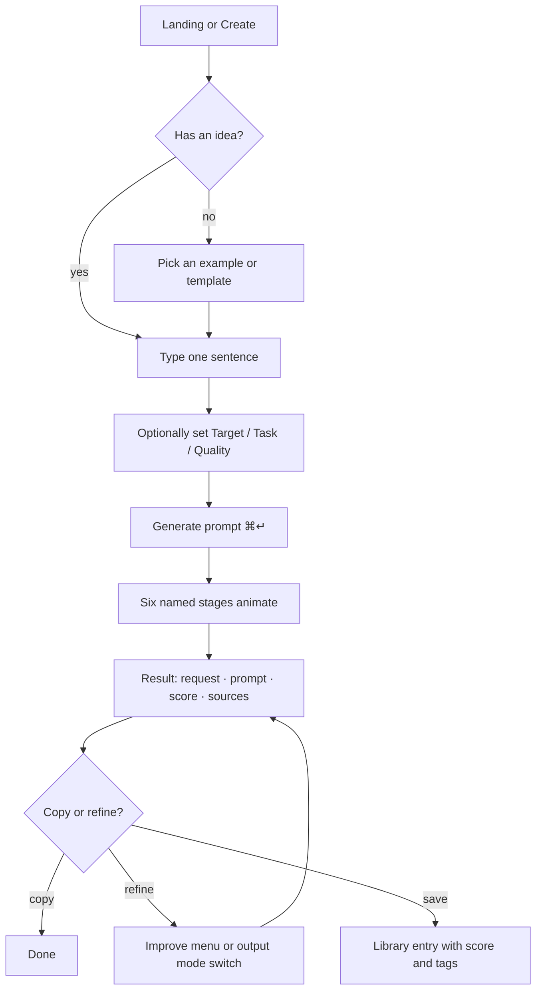
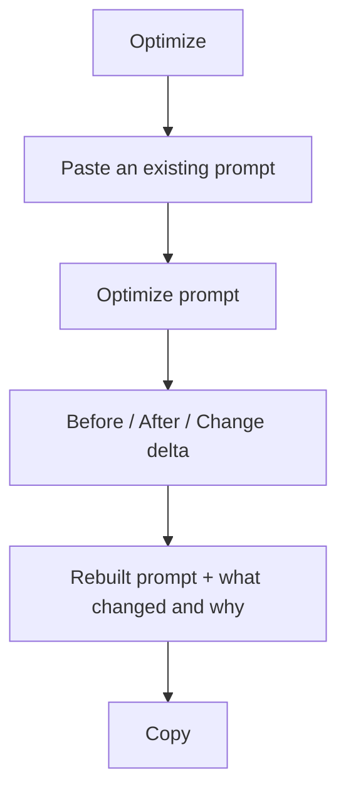
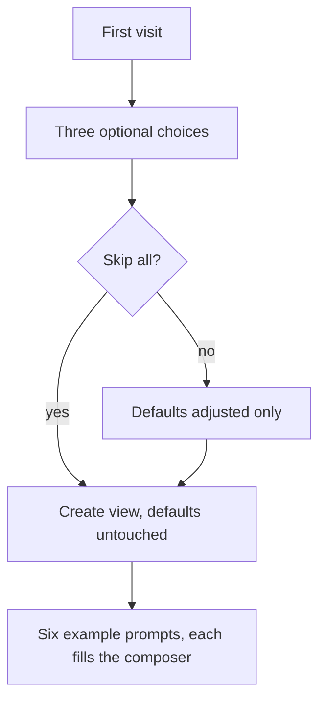

# App flow

Screens, navigation, and the user journeys that matter. Written before the code,
kept accurate to it.

---

## Screens

Eight views. Each has exactly one purpose and one dominant action.

| View | Purpose | Primary action | Secondary (progressively disclosed) |
|---|---|---|---|
| **Landing** | Explain the product | Start building | Explore templates |
| **Create** | Turn a description into a prompt | **Generate prompt** | More options · Add material · Clear · Examples |
| **Optimize** | Improve an existing prompt | **Optimize prompt** | Target selector |
| **Test** | Evaluate up to three prompts | **Run evaluation** | Add a third prompt |
| **Compare** | Compare prompts side by side | **Compare** | — |
| **Templates** | Start from a known-good shape | **Use template** | Search · category filters |
| **Library** | Find and manage saved prompts | **Open** | Favourite · duplicate · delete · export |
| **Settings** | Preferences and data control | *(no single CTA — a settings page, by nature)* | — |

### Navigation

```
Desktop   rail (Create · Optimize · Test · Compare | Templates · Library · Settings)
          top bar (brand · workspace indicator · engine status · theme · palette)
Mobile    bottom tab bar (Create · Templates · Library · Settings)
          everything else reached through the command palette or in-page actions
```

Advanced views (Test, Compare) sit on the rail for desktop discovery but are
deliberately **absent** from the mobile tab bar — on a phone, the primary flow
matters more than feature parity. They remain reachable via `⌘K` and from the
result panel's secondary actions.

## Core journeys

### J1 — Describe and generate *(the primary journey)*



**Success:** from land to copied prompt in under a minute, with no understanding of
prompting required.

**Error paths**

| Failure | Behaviour |
|---|---|
| Empty input | Inline prompt to describe something first; focus returns to the composer |
| Engine error | Plain-language message + **Try again** / **Edit request**; composer state preserved |
| API unreachable | Silent fallback to the browser engine; status chip changes to "No-AI mode" |
| Offline entirely | Same as above — the engine ships with the page |

### J2 — Paste and improve



**Edge cases:** pasted text containing instructions aimed at a model is stripped,
reported, and never obeyed; a pasted "Improve this prompt:" wrapper is unwrapped
once rather than nested.

### J3 — Evaluate and choose

```
Test → paste A (and optionally B, C) → Run evaluation
     → verdict sentence → metric table with the strongest value per row
     → overall row → calibration note
```

**Edge cases:** one prompt is scored, not compared; more than three is refused;
prompts below a usable length are still scored but say so through the notes.

### J4 — Start from a template

```
Templates → search or filter → Use template
          → Create opens with the text inserted and the first [placeholder] selected
          → replace → Generate
```

### J5 — Save, find and reuse

```
Result → Save (⌘S) → toast confirms
Library → search / filter (All · Favourites · Recent · Score 75+)
        → Open (loads into the composer) · Favourite · Duplicate · Delete
```

### J6 — First run



The onboarding sets **defaults only**. It never records a claim about the user, and
skipping is a first-class action, not a dismissal to be nagged about.

## Edge cases and error paths

| Situation | Expected behaviour |
|---|---|
| Very long input (a pasted document) | Accepted up to the size guard; counter shows words and approximate tokens |
| Oversized request to the API | `413` with "Trim the input and try again" — never a stack trace |
| Malformed JSON to the API | `400` with a usable message and hint |
| Unknown `targetId` | `400` naming the offending value, suggesting the automatic mode |
| Unknown action on `/api/analyze` | `400` listing the supported actions |
| All templates filtered out | Empty state with explanation and a reset action |
| Empty library | Empty state explaining saving, with a CTA back to Create |
| JavaScript disabled | Static HTML remains readable; the product itself requires JS, and the README says so |
| `prefers-reduced-motion` | Ambient field disabled; all transitions reduced to near-zero |
| Screen reader | Landmarks, labelled controls, live regions for generation and toasts, focus trapped in modals |
| Refreshing mid-result | Composer draft is restored from local storage; the last result is not (a deliberate choice — stale results are worse than none) |

## What is deliberately absent

Each of these was considered and left out under the one-screen-one-purpose rule:

- A dashboard or metrics wall — the numbers that matter appear next to the prompt they describe.
- A history timeline — the Library covers retrieval; a timeline competes with it.
- A settings surface on the Create screen — it lives in Settings, with defaults applied automatically.
- Per-model parameter controls (temperature and similar) — they are not part of prompt text, and exposing them would require teaching the vocabulary the product exists to hide.
